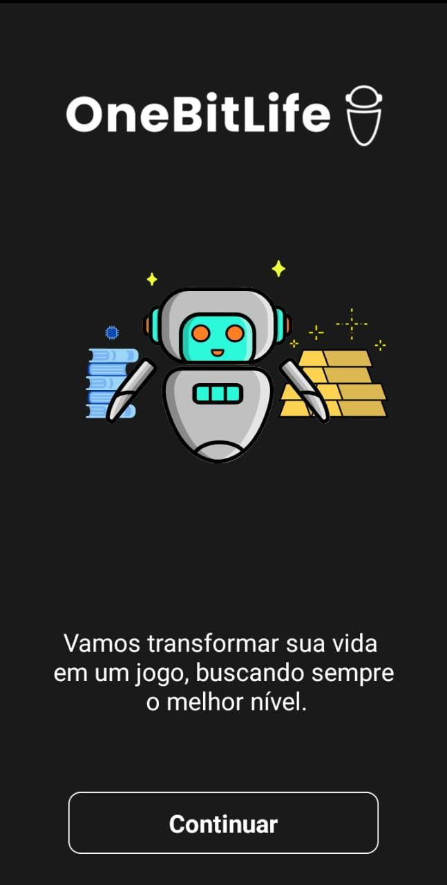

<h1 align="center"> OneBitLife </h1>

Aplicativo para gerenciamento de atividades diárias.

  <a href="#-tecnologias">Tecnologias</a>&nbsp;&nbsp;&nbsp;|&nbsp;&nbsp;&nbsp;
  <a href="#-projeto">Projeto</a>&nbsp;&nbsp;&nbsp;|&nbsp;&nbsp;&nbsp;
  <a href="#memo-licença">Licença</a>

  

 

## 🚀 Tecnologias

Esse projeto foi desenvolvido com as seguintes tecnologias:

- React Native
- React
- Expo
- JavaScript e JSON
- [Node](https://nodejs.org/)

---

## 💻 Projeto

Aplicação promete gerenciar atraves de gameficação as tarefas diárias com base no robô bitizinho.

### :iphone: Imagens
<h4>Tela inicial</h4>

Apresentação do robô com as primeiras impressões da aplicação

---

## :memo: Licença

Esse projeto está sob a licença GNU.
